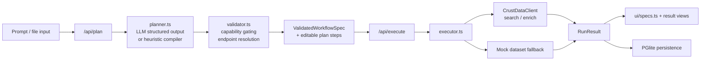

# ContextKings

ContextKings is a local-first AI research workflow builder for CrustData. Instead of returning a one-shot chat answer, it compiles a plain-English request into an inspectable workflow, lets the user edit the plan, executes the data pipeline, and renders the result as an analytics workspace.

## What It Does

- Compiles prompts into typed workflow specs for company research, prospecting, recruiting, and comparison tasks.
- Accepts plain text plus optional CSV, TXT, JSON, and XLSX inputs to bootstrap identifiers or local source context.
- Executes against supported CrustData search/enrich endpoints, then derives ranked insights and dashboard-ready records.
- Persists planner state and saved runs locally in the browser using PGlite.
- Falls back gracefully when keys are missing: no OpenAI key uses a heuristic planner, no CrustData key uses labeled mock execution.

## Architecture



## Technical Design

- `planner.ts` converts natural language into a constrained `WorkflowSpec`, extracts identifiers from prompt or uploaded rows, detects follow-up refinements, and remaps unsupported connector language into the closest supported CrustData flow.
- `validator.ts` normalizes the spec into a `ValidatedWorkflowSpec`, gates web workflows behind `CRUSTDATA_ENABLE_WEB`, resolves field selections/endpoints, and collapses known-identifier flows directly into enrich steps.
- `executor.ts` runs search-then-enrich or direct-enrich paths, normalizes heterogeneous CrustData payloads, applies local filter logic, derives insight summaries, and returns a stable `RunResult` contract for the UI.
- `lib/ui/specs.ts` turns each run into a structured analytics canvas via `@json-render`, while specialized React views render company research, candidate lists, and comparison layouts.
- `lib/persistence/*` uses browser-backed PGlite to store threads, messages, workflows, runs, records, and saved artifacts without requiring a backend database.

## Supported Workflow Modes

- `company-search -> company-enrich -> analyze -> dashboard/report/list`
- `person-search -> person-enrich -> analyze -> shortlist`
- `manual-list/csv -> enrich -> compare/rank/research`
- `comparison-view`, `table-first`, `cards-first`, `report`, and dashboard outputs

## Why The Architecture Matters

- Plans are inspectable and editable before execution, which makes the system more trustworthy than opaque agent chains.
- The workflow contract is typed end-to-end with Zod, so planning, execution, persistence, and rendering all share the same schema boundary.
- The demo is resilient: it still works without live credentials, but clearly labels mocked and partial runs.
- State is local-first, so judges can refresh, restore prior runs, and replay workflows without standing up extra infrastructure.

## Repo Map

- `app/api/plan/route.ts`: plan compilation endpoint
- `app/api/execute/route.ts`: workflow execution endpoint
- `app/api/chat/route.ts`: alternate streamed chat runtime with AI SDK tools and JSON-render output
- `lib/workflow/*`: planner, validator, executor, and shared schemas
- `lib/crustdata/client.ts`: CrustData adapter and filter sanitization
- `lib/ui/*`: render catalog, component registry, analytics canvas spec
- `lib/persistence/*`: browser-local PGlite storage layer
- `components/*`: planning, execution-progress, and results UX
- `tests/*`: planner, plan-mode, executor, and CrustData client coverage

## Local Run

```bash
npm install
npm run dev
```

Create `.env.local` from `.env.example` and add your keys before starting the app.

Optional verification:

```bash
npm test
```

## Environment

- `OPENAI_API_KEY`
- `OPENAI_MODEL` default `gpt-5.4`
- `OPENAI_REASONING_EFFORT` default `high`
- `CRUSTDATA_API_KEY`
- `CRUSTDATA_API_VERSION` default `2025-11-01`
- `CRUSTDATA_ENABLE_WEB` default `true`
- `NEXT_PUBLIC_SITE_URL` default `http://localhost:3000`
